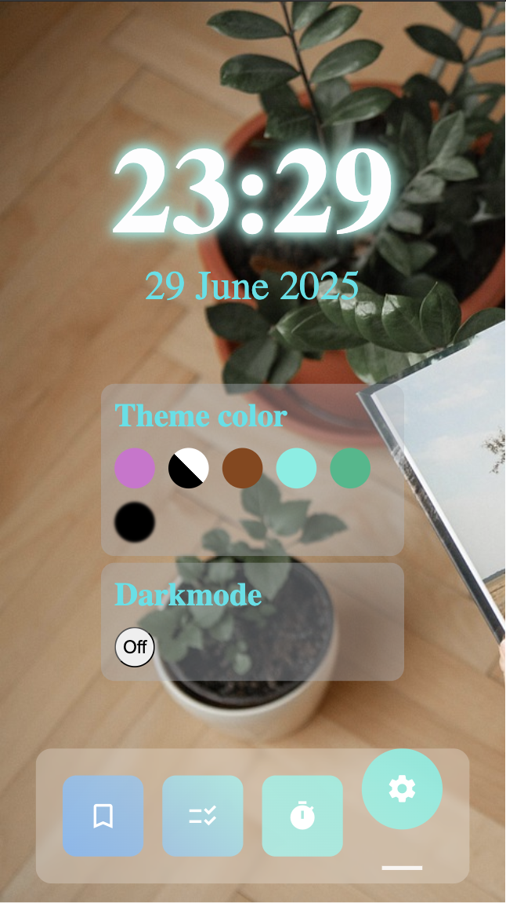
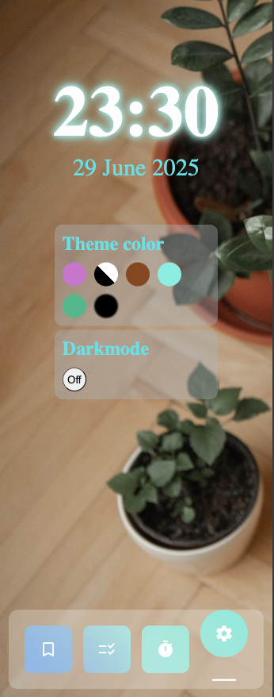
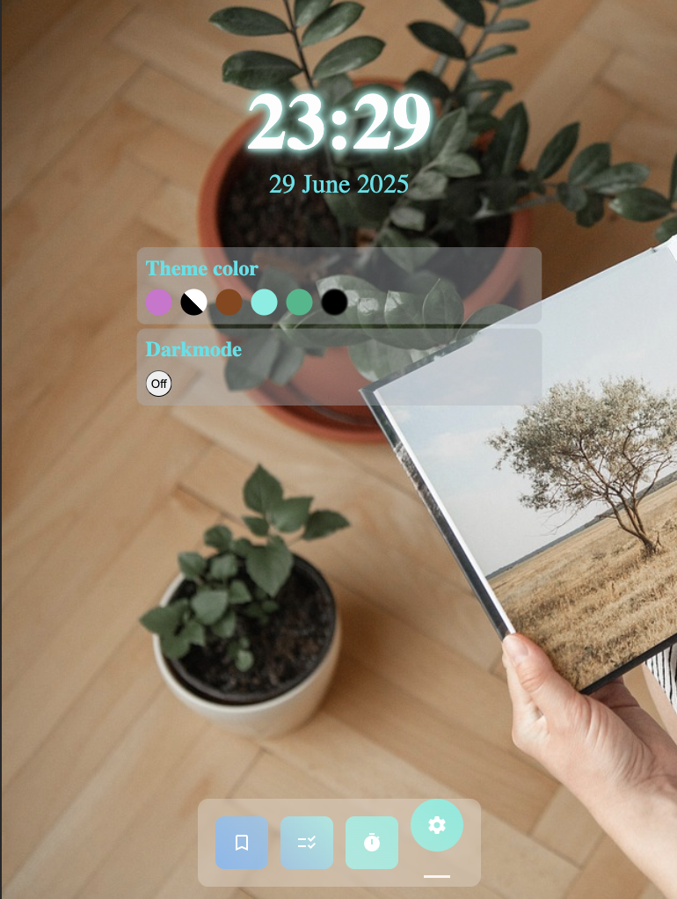

# Personal Dashboard
This is a personal dashboard web app. It features:
- Date & time
- Bookmarks
- Todos
- Timer
- Colored themes & darkmode

This project was generated using [Angular CLI](https://github.com/angular/angular-cli) version 20.0.2.

## Table of Content
- [Tech Stack](#tech-stack)
- [Installation](#Installation)
- [Screenshots](#screenshots)
- [Responsive Design](#responsive-design)
- [License](#license)

## Tech Stack
- Angular.js
- TypeScript
- SASS
- Angular Materials

## Installation
### Frontend Setup

1. Clone the repository:
    ```bash
    git clone https://github.com/suz608/PersonalDashboard.git
    cd PersonalDashboard

2. Navigate to the project folder and install dependencies:
    ```bash
    cd personal-dashboard
    npm install
    ```
3. To start a local development server, run:

    ```bash
    ng serve
    ```

Once the server is running, open your browser and navigate to `http://localhost:4200/`. The application will automatically reload whenever you modify any of the source files.

4. To build the project run:

```bash
ng build
```

This will compile your project and store the build artifacts in the `dist/` directory. By default, the production build optimizes your application for performance and speed.

## Screenshots
Here are some screenshots of the app in action:
- Bookmarks Page:
  
- Timer Page:
  
- To-do list Page:
  
- Settings Page:
  

## Responsive Design
This app adapts well on devices of different sizes. Here are some screenshots:

- iPhoneSE:
  
  
- GalaxyZFold5:
  

- iPadMini:
  

## License
PersonalDashboard is open-source and available under the MIT License.
