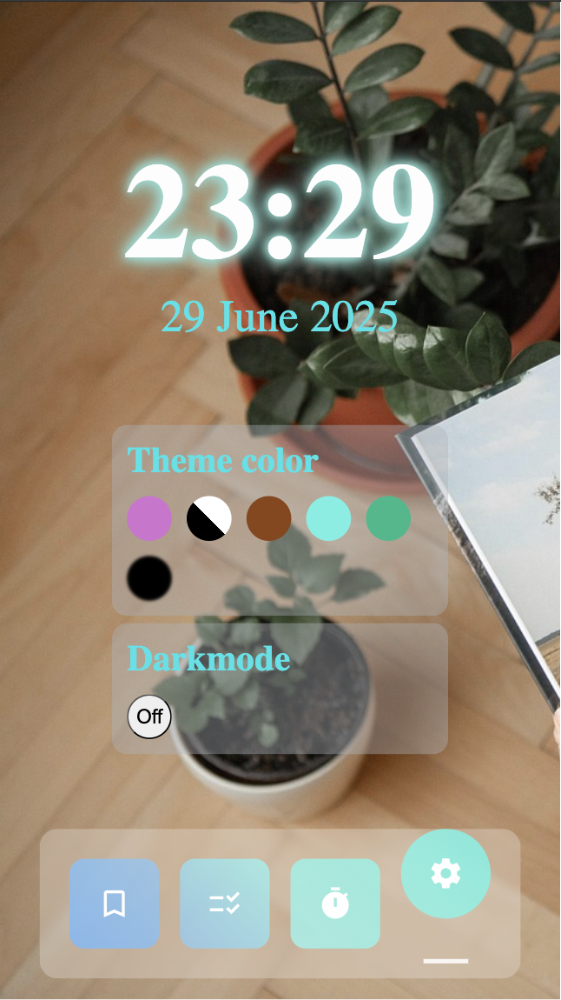
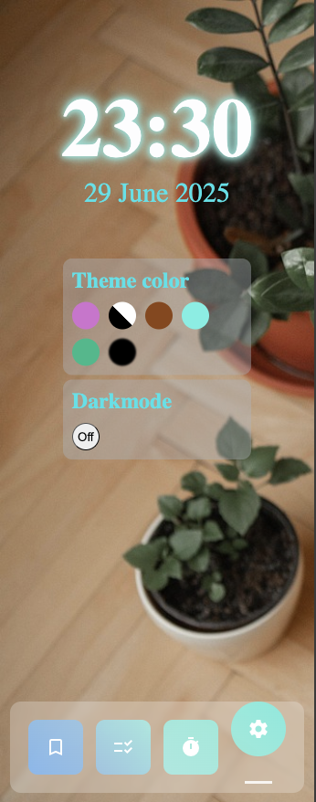
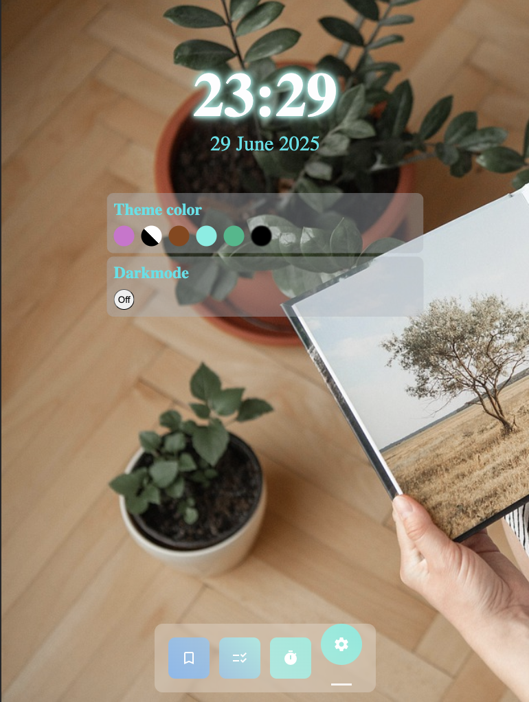

# Personal Dashboard
This is a personal dashboard web app. It features:
- 📅 Date & time
- 🔖 Bookmarks
- ✅ Todos
- ⏲️ Timer
- 🌄 Random background images
- 🎨 Colored themes & dark mode

> 🌐 [Live Demo (Hosted on AWS S3)](https://personal-dashboard-website.s3.ap-southeast-1.amazonaws.com/index.html)

> ⚙️ Built with Angular + RxJS + SASS

## Table of Content
- [Tech Stack](#tech-stack)
- [Installation](#Installation)
- [Backend Servers](#backend-servers)
- [Docker Setup](#docker-setup)
- [Screenshots](#screenshots)
- [Responsive Design](#responsive-design)
- [License](#license)

## Tech Stack
### Frontend
- Angular(20.0.2)
- Node.js
- RxJS
- TypeScript
- SASS
- Angular Materials
- Pixabay API
### Backend
#### GraphQL + Spring Boot
- Java 24 
- Maven
- Spring Boot 3.5.3
- MySQL 9.3.0
- GraphQL
#### Django
- Django
- Django Rest Framework
- Django CORS Headers
- Pip & pipenv
- SQLite
### Could Services
- AWS S3

## Installation
### Frontend Setup

1. Clone the repository:
    ```bash
    git clone https://github.com/suz608/PersonalDashboard.git
    cd PersonalDashboard

2. Navigate to the project folder and install dependencies:
    ```bash
    cd personal-dashboard
    npm install
    ```
3. Generate environment:

  This app uses Pixabay API for background images. For safety reasons, the API keys are stored in environment files. You could get your own API key follow the official documentation at [API-Pixabay](https://pixabay.com/service/about/api/), then, replace '<Pixabay-API-URL>' with your API key in the environment files.

  For development, create a new file at `./src/environments/environment.development.ts` and add the following configuration:

  ```bash
  export const environment = {
    production: false,
    pixabayKey: '<Pixabay-API-URL>',
  };
  ```

  For production, create a new file at `./src/environments/environment.ts` and add the following configuration:

  ```bash
  export const environment = {
    production: true,
    pixabayKey: '<Pixabay-API-URL>',
  };
  ```

4. To start a local development server, run:

    ```bash
    ng serve
    ```

Once the server is running, open your browser and navigate to `http://localhost:4200/`. The application will automatically reload whenever you modify any of the source files.

5. To build the project run:

```bash
ng build
```

This will compile your project and store the build artifacts in the `dist/` directory. By default, the production build optimizes your application for performance and speed.

## Backend Servers
This repository only includes the frontend of this app. The backend servers are available in following repositorys.
- **GraphQL+Spring Boot server**
  [SpringGraphQLAPI](https://github.com/suz608/spring-graphql-api).
- **Django+RESTful apis**
  [DjangoRestAPI](https://github.com/suz608/django-rest-api).

> The GitHub version uses local storage for data management, as adjustments are required to accommodate differences between RESTful and GraphQL APIs.  The architecture allows for straightforward backend integration with minor modifications.

## Docker Setup
Follow these steps to build and run the app in a Docker container.
### 1. Build the Docker Image
From the root of the project, where your Dockerfile is located, run the following command:
```bash
docker build -t personal-dashboard .
```
### 2. Run the Docker Container
After the image is successfully built, you can run the container with:
```bash
docker run -p 8080:80 personal-dashboard
```
This will run the application in the container and map the container’s port 80 to your local port 8080.

Now, you should be able to access the app in your browser at http://localhost:8080.
### 3. Clean Up Docker Containers and Images (Optional)
If you need to remove the container or image, you can use the following commands:
Stop the container:
```bash
docker stop <container-id>
```
Remove the container:
```bash
docker rm <container-id>
```
Remove the image:
```bash
docker rmi expense-tracker
```

## Screenshots
Here are some screenshots of the app in action:
- Bookmarks Page:
  
- Timer Page:
  
- To-do list Page:
  
- Settings Page:
  

## Responsive Design
This app adapts well on devices of different sizes. Here are some screenshots:

- iPhoneSE:
  
  
- Galaxy Z Fold 5:
  

- iPadMini:
  

## License
PersonalDashboard is open-source and available under the MIT License.
